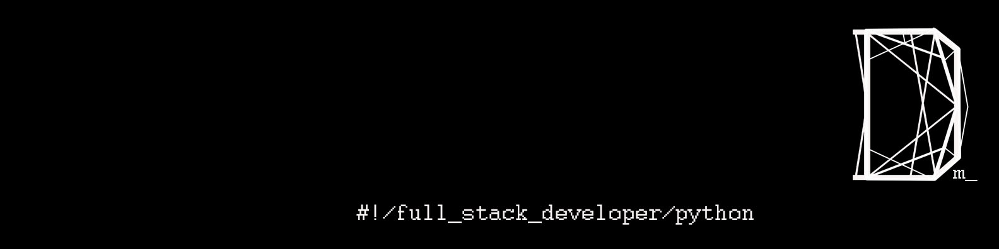

# Hola, mi nombre es Darwin Moreno 👋
### Data Scientist and full-stack dev

Soy un Científico de Datos con Python como mi lenguaje principal. Me apasiona resolver desafiantes problemas lógicos 🤓. Siempre estoy en la búsqueda de mejorar mis habilidades y conocimientos para lograr resultados aún más óptimos.

Mi formación en Ingeniería Civil me ha proporcionado sólidos conocimientos en álgebra, matemáticas, física, probabilidad y estadística. Estos fundamentos me han permitido desarrollar un pensamiento analítico, crítico y lógico. Además, cuento con experiencia en metodologías ágiles, estructuras de datos y aprendizaje automático. He participado en proyectos de arquitectura de datos, creación de bases de datos y análisis de datos para generar informes interactivos.

En este momento, estoy en la búsqueda de🔎 un entorno de trabajo que fomente mi crecimiento y experiencia 💾. Si bien mi objetivo principal es un rol como Científico de Datos, mis conocimientos también me capacitan para desempeñarme en posiciones de Analista de Datos, Ingeniero de Datos y/u Operaciones de Aprendizaje Automático.

## Tecnologías:

)

 

 

 
Y algunas más...

## Contacto:

 

 

